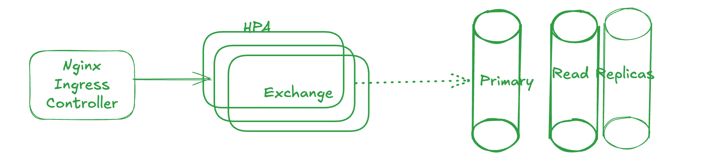

# Task descriptions

## CI/CD
A sample simplifed Dockerfile CI/CD jobs added to the project which includes:
  - sample unit test 
  - sample smoke test job by k6
  - build
  - migration job
  - deploy

CI/CD can be improved by:
  - seperating staging/UAT/production envs
  - AI assisted code review on merge requests
  - DevSecOps jobs
  - Load Test on different APIs
  - Utilizing a CD tool such as FluxCD or ArgoCD and adding GitOps

## Postgresql
A simplified postgresql helm values added to the repo which also includes a simple k8s CronJob to backup and also prom rules. Backup job can be improved using a backup solution such as velero and also backing up WAL in certain circumstances.

## Observability
Sample helm values added to the repo.